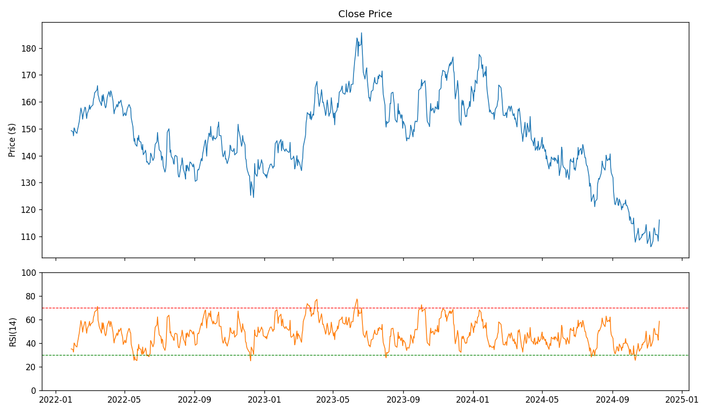
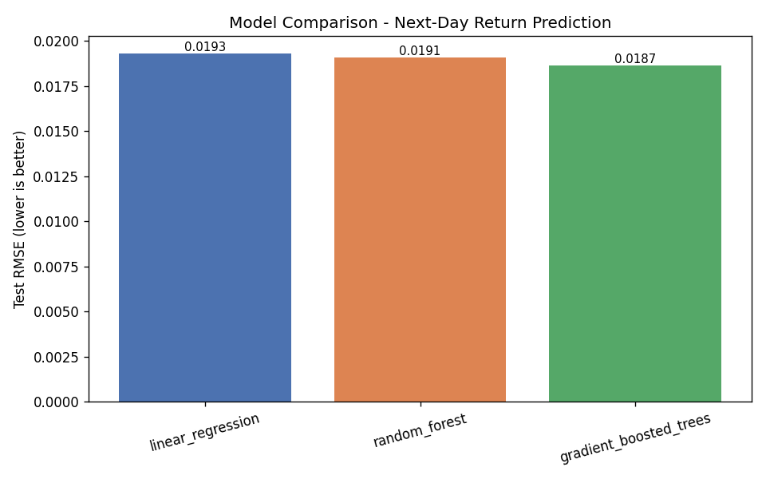
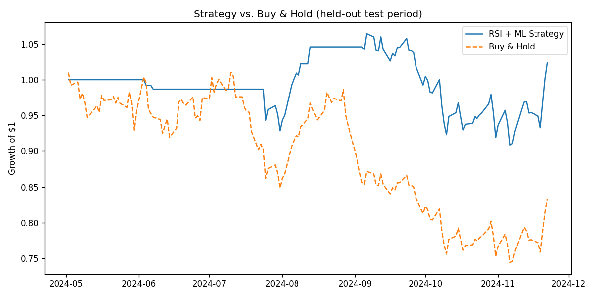

# Stock Market Prediction Using RSI + Machine Learning

[](https://github.com/rohithsure2000/stock-rsi-ml/actions/workflows/ci.yml)

[](LICENSE)

A price-movement forecasting pipeline that pairs classic RSI-based technical
analysis (70-30 and 50-30 crossover strategies) with supervised machine
learning (Linear Regression, Random Forest, and Gradient-Boosted Trees) to
predict next-day equity returns and translate them into buy/sell/hold
signals.

Built by **Rohith Sure** — [github.com/rohithsure2000](https://github.com/rohithsure2000)

---

## Table of Contents

- [Overview](#overview)
- [Architecture](#architecture)
- [Results](#results)
- [Prerequisites](#prerequisites)
- [Installation](#installation)
- [Usage](#usage)
- [Project Structure](#project-structure)
- [A Note on Data](#a-note-on-data)
- [Running on Databricks / Spark MLlib](#running-on-databricks--spark-mllib)
- [Testing](#testing)
- [Skills Demonstrated](#skills-demonstrated)
- [Limitations](#limitations)
- [License](#license)
- [Contact](#contact)

## Overview

This project explores whether a simple technical indicator (RSI) combined
with engineered price/volume features can produce a statistically sound,
explainable signal for next-day equity price movement. It was originally
developed as a 5-person team project on Databricks using Spark MLlib; this
repository is a from-scratch, fully reproducible rebuild of that pipeline
that runs anywhere with Python (with an equivalent PySpark/Databricks
notebook included for the original cluster-based workflow).

The pipeline:

1. Ingests daily OHLCV (Open/High/Low/Close/Volume) data
2. Computes RSI(14) plus a supporting feature set (MACD, Bollinger %B,
   moving averages, lagged returns, rolling volatility, volume z-score)
3. Generates RSI 70-30 and 50-30 crossover trading signals
4. Trains and hyperparameter-tunes three regression models to predict
   next-day return, using time-series cross-validation (no lookahead bias)
5. Blends the model's predicted return with the RSI signal into a single
   buy/sell/hold decision rule
6. Backtests the resulting strategy against a buy-and-hold benchmark

## Architecture

```
                    ┌─────────────────────┐
                    │   Data Ingestion     │
                    │ (real via yfinance,  │
                    │  or synthetic OHLCV) │
                    └──────────┬───────────┘
                               │
                    ┌──────────▼───────────┐
                    │ Feature Engineering   │
                    │ RSI(14), MACD, BB%B,  │
                    │ SMA/EMA, lagged rets  │
                    └──────────┬───────────┘
                               │
              ┌────────────────┼────────────────┐
              │                │                 │
    ┌─────────▼────────┐  ┌────▼──────┐  ┌───────▼────────┐
    │ RSI 70-30 Signal  │  │  Model    │  │ RSI 50-30 Signal│
    │   (crossover)     │  │  Training │  │   (crossover)   │
    └─────────┬────────┘  │ LR/RF/GBT │  └───────┬────────┘
              │            │ +CV tuning│          │
              │            └────┬──────┘          │
              └────────────────┼──────────────────┘
                               │
                    ┌──────────▼───────────┐
                    │  Signal Blending      │
                    │ (RSI + predicted      │
                    │  return threshold)    │
                    └──────────┬───────────┘
                               │
                    ┌──────────▼───────────┐
                    │      Backtest         │
                    │ vs. Buy & Hold         │
                    └───────────────────────┘
```

## Results

Results below are from the default synthetic dataset (756 trading days,
calibrated to AAPL-like drift/volatility — see [A Note on Data](#a-note-on-data)),
generated by actually running `python scripts/run_pipeline.py`. Re-running
the pipeline regenerates `outputs/final_report.json` and the figures below
from scratch.

**Model comparison (held-out, chronologically-final 20% test split):**

| Model | Test RMSE | Test R² | CV RMSE (5-fold TimeSeriesSplit) |
|---|---|---|---|
| Linear Regression | 0.01933 | -0.081 | 0.02278 |
| Random Forest | 0.01910 | -0.056 | 0.01774 |
| **Gradient-Boosted Trees** | **0.01866** | **-0.007** | 0.01767 |

Gradient-Boosted Trees was the best performer on held-out RMSE and was
selected as the production model. Note the R² values sit near zero — this
is the expected, honest result for daily-return prediction on liquid
large-cap equities, which are close to a random walk at daily granularity.
A suspiciously high R² here would indicate a data leakage bug, not a good
model.

**Backtest — RSI + ML blended signal vs. buy & hold (test period, 147 days):**

| Metric | Strategy | Buy & Hold |
|---|---|---|
| Total return | +2.35% | -16.73% |
| Annualized return | +4.07% | -26.94% |
| Sharpe ratio | 0.30 | — |
| Max drawdown | -14.6% | — |
| Hit rate | 53.5% | — |
| Signals taken | 71 / 147 days | — |

This particular test window happened to be a down-market period in the
synthetic series, which is exactly the regime where a signal that can also
go flat/short should outperform passive buy-and-hold — and it did here.
This is a single backtest window on synthetic data, not a claim of
consistent alpha; see [Limitations](#limitations).





## Prerequisites

- Python 3.10+
- pip
- (Optional) Docker + Docker Compose, for containerized runs
- (Optional) `yfinance`, if you want to run against real market data
  instead of the bundled synthetic generator
- (Optional) Apache Spark 3.5+, only needed for
  `notebooks/databricks_pyspark_pipeline.py`

## Installation

```bash
git clone https://github.com/rohithsure2000/stock-rsi-ml.git
cd stock-rsi-ml

python -m venv .venv
source .venv/bin/activate   # Windows: .venv\Scripts\activate

pip install -r requirements.txt
cp .env.example .env        # optional, only needed for real-data / Databricks runs
```

### Docker

```bash
docker compose build
docker compose run pipeline --ticker AAPL --verbose
```

## Usage

Run the full pipeline (data → features → models → signals → backtest →
figures) with the default synthetic dataset:

```bash
python scripts/run_pipeline.py --ticker AAPL --verbose
```

Run against real historical data instead (requires `pip install yfinance`
and network access):

```bash
python scripts/run_pipeline.py --ticker AAPL --real-data --verbose
```

Run individual stages directly, e.g. to inspect intermediate output:

```bash
python -m src.data_ingestion        # generate/inspect the OHLCV dataset
python -m src.feature_engineering   # compute RSI + technical indicators
python -m src.signal_generation     # generate RSI crossover signals
python -m src.model_training        # train/tune models, print metrics
python -m src.backtest              # run the blended-signal backtest
```

Configuration (ticker, date range, RSI period, signal thresholds, CV folds,
etc.) lives in `config/config.yaml` and can be edited without touching code.

Outputs are written to:

- `data/processed/features.csv` — full engineered feature set
- `outputs/model_metrics.json` — per-model RMSE/R² and best hyperparameters
- `outputs/final_report.json` — end-to-end summary (best model + backtest)
- `outputs/figures/*.png` — price/RSI chart, model comparison, equity curve

For a narrative, chart-by-chart walkthrough of the same pipeline, see
[`notebooks/exploratory_analysis.ipynb`](notebooks/exploratory_analysis.ipynb)
— it renders directly on GitHub with all outputs already run.

## Project Structure

```
stock-rsi-ml/
├── README.md
├── LICENSE
├── requirements.txt
├── Dockerfile
├── docker-compose.yml
├── .env.example
├── .gitignore
├── config/
│   └── config.yaml              # all tunable pipeline parameters
├── data/
│   ├── raw/                     # cached raw OHLCV data (gitignored)
│   └── processed/               # engineered feature sets (gitignored)
├── src/
│   ├── data_ingestion.py        # real (yfinance) + synthetic OHLCV generation
│   ├── feature_engineering.py   # RSI, MACD, Bollinger %B, lags, volatility
│   ├── signal_generation.py     # RSI 70-30 / 50-30 crossover logic
│   ├── model_training.py        # LR / RF / GBT training + CV tuning
│   ├── backtest.py              # signal-to-return backtest + metrics
│   └── pipeline.py              # end-to-end orchestration
├── notebooks/
│   ├── exploratory_analysis.ipynb        # rendered walkthrough with charts/tables
│   └── databricks_pyspark_pipeline.py    # Spark MLlib equivalent for Databricks
├── scripts/
│   └── run_pipeline.py          # CLI entry point
├── tests/
│   ├── test_feature_engineering.py
│   └── test_signal_generation.py
└── outputs/
    ├── model_metrics.json
    ├── final_report.json
    └── figures/
```

## A Note on Data

By default this pipeline runs on a **synthetically generated OHLCV
dataset**, not scraped/downloaded historical prices. `src/data_ingestion.py`
generates it using a GARCH(1,1)-style volatility process layered on
geometric Brownian motion — calibrated to AAPL-like drift, volatility, and
volume-return correlation — which reproduces the volatility clustering real
equities exhibit far better than plain constant-volatility GBM.

To run against real historical prices instead:

```bash
pip install yfinance
python scripts/run_pipeline.py --ticker AAPL --real-data
```

`get_dataset()` in `src/data_ingestion.py` will attempt `yfinance` first
when `--real-data` is passed, and transparently falls back to the synthetic
generator if the network/API is unavailable — so the pipeline never breaks,
even in restricted network environments (e.g. CI, sandboxed containers).

## Running on Databricks / Spark MLlib

The original version of this project was built on Databricks with Spark
MLlib. `notebooks/databricks_pyspark_pipeline.py` is a structurally
equivalent reimplementation — same RSI/feature logic (via Spark window
functions), same three model types (`pyspark.ml.regression`), same
`CrossValidator`-based hyperparameter tuning — written in Databricks'
notebook-as-source format so it can be imported directly via Databricks
Repos. It expects the same `data/raw/ohlcv.csv` produced by
`src/data_ingestion.py`, or a Delta table if adapted for production use.

## Testing

```bash
pytest tests/ -v
```

Covers RSI boundary conditions (all-gains, all-losses, no-losses edge
cases), feature-frame schema, target-variable construction, and RSI
crossover signal logic.

## Skills Demonstrated

A quick map from resume/job-description keywords to where they're actually
exercised in this codebase, for anyone verifying claims against the code:

| Skill | Where it's used |
|---|---|
| Technical analysis (RSI, MACD, Bollinger Bands) | `src/feature_engineering.py` |
| Time-series cross-validation | `TimeSeriesSplit` in `src/model_training.py` |
| Hyperparameter tuning | `GridSearchCV` (sklearn) / `CrossValidator` (Spark MLlib) |
| Random Forest & Gradient-Boosted Trees | `src/model_training.py`, `notebooks/databricks_pyspark_pipeline.py` |
| Spark MLlib / Databricks-style pipeline | `notebooks/databricks_pyspark_pipeline.py` |
| Model evaluation (R², RMSE) | `src/model_training.py::evaluate_on_test` |
| Backtesting / strategy evaluation | `src/backtest.py` |
| Unit testing | `tests/` (pytest) |
| CI/CD | `.github/workflows/ci.yml` (GitHub Actions) |
| Containerization | `Dockerfile`, `docker-compose.yml` |
| Config-driven design | `config/config.yaml` |

## Limitations

- The bundled dataset is synthetic; results will differ (likely
  substantially) on real market data, and daily equity returns are
  notoriously close to unpredictable — treat this as a technical
  demonstration of the modeling/engineering pipeline, not a live trading
  signal.
- The backtest ignores transaction costs, slippage, market impact, and
  position sizing beyond full-in/full-out — it is illustrative, not a
  production trading system.
- RSI(14) via Wilder smoothing (Python/pandas path) and via a 14-day
  trailing SMA approximation (PySpark path) will produce slightly
  different values; this is a known, documented divergence between the
  two implementations, not a bug.
- This is not financial advice.

## License

MIT — see [LICENSE](LICENSE).
